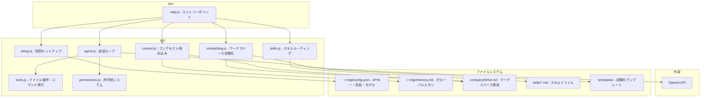
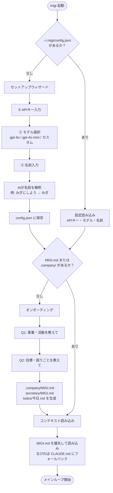
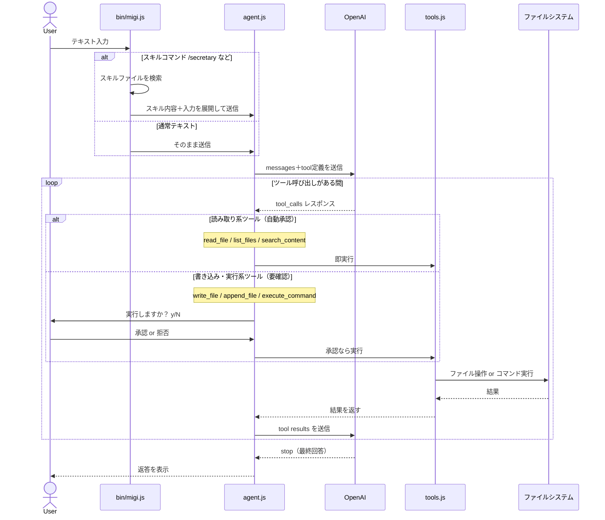
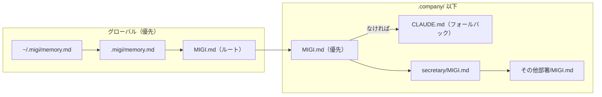
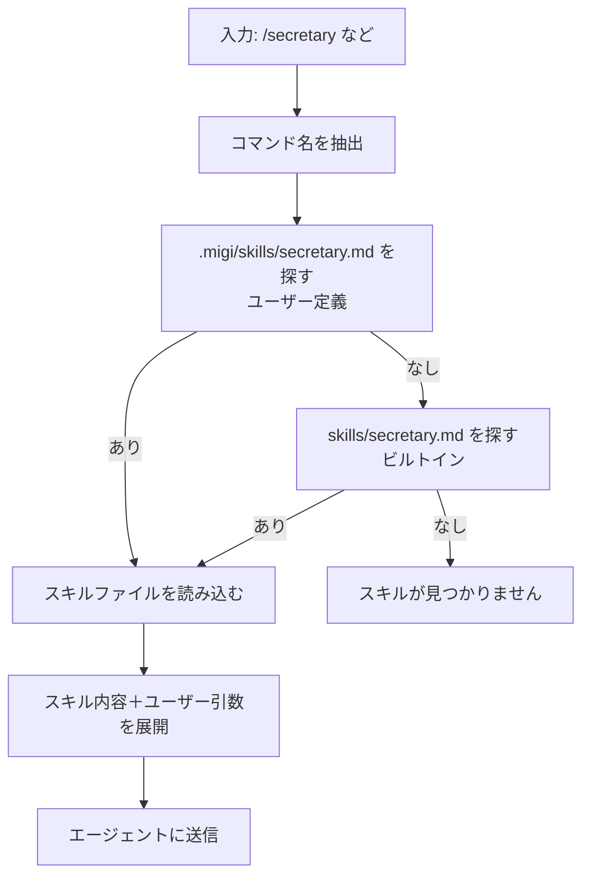

# Migi（ミギ）

> あなたの右腕として動く AI エージェント CLI
> Powered by OpenAI API — by MAKE U FREE

---

## 全体アーキテクチャ



---

## 起動フロー



---

## リクエスト処理フロー



---

## コンテキスト読み込みの優先順位



---

## スキルシステム



---

## ファイル構成

```
migi/
├── bin/
│   └── migi.js           # エントリーポイント・メインループ
├── src/
│   ├── agent.js          # OpenAI 会話ループ・ツール呼び出し制御
│   ├── context.js        # MIGI.md / memory.md の読み込み
│   ├── onboarding.js     # 空ワークスペースの初期化ウィザード
│   ├── permissions.js    # 書き込み・実行の許可制
│   ├── setup.js          # APIキー・モデル・名前のセットアップ
│   ├── skills.js         # /コマンドのスキルルーティング
│   └── tools.js          # ファイル操作・コマンド実行ツール
├── skills/
│   └── secretary.md      # ビルトインスキル（秘書モード）
├── templates/
│   ├── company-migi.md   # .company/MIGI.md のテンプレート
│   └── secretary-migi.md # secretary/MIGI.md のテンプレート
└── package.json

# ユーザーのワークスペース（起動ディレクトリ）
{cwd}/
├── MIGI.md               # ワークスペース設定（なければ CLAUDE.md）
├── todos/
│   └── YYYY-MM-DD.md    # 日次TODO
└── .company/
    ├── MIGI.md           # 組織設定
    └── secretary/
        ├── MIGI.md       # 秘書ルール
        ├── inbox/
        └── notes/

# グローバル設定
~/.migi/
├── config.json           # APIキー・モデル・名前
└── memory.md             # 全ワークスペース共通メモリ
```

---

## セットアップ

```bash
git clone https://github.com/kazuhiro-yourself/migi.git
cd migi
npm install

# 作業ディレクトリで起動（初回は自動セットアップ）
cd ~/your-workspace
node /path/to/migi/bin/migi.js
```

## 使い方

```
> 今日のTODO見せて     # 普通に話しかけるだけ
> /secretary           # 秘書モードを明示的に起動
> /config              # 設定変更
> /exit                # 終了
```
